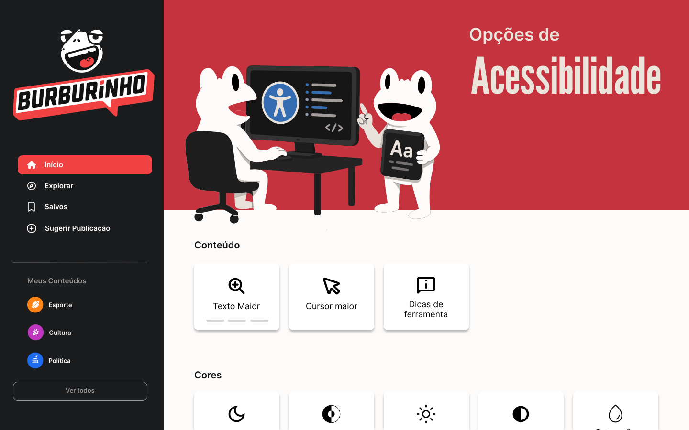
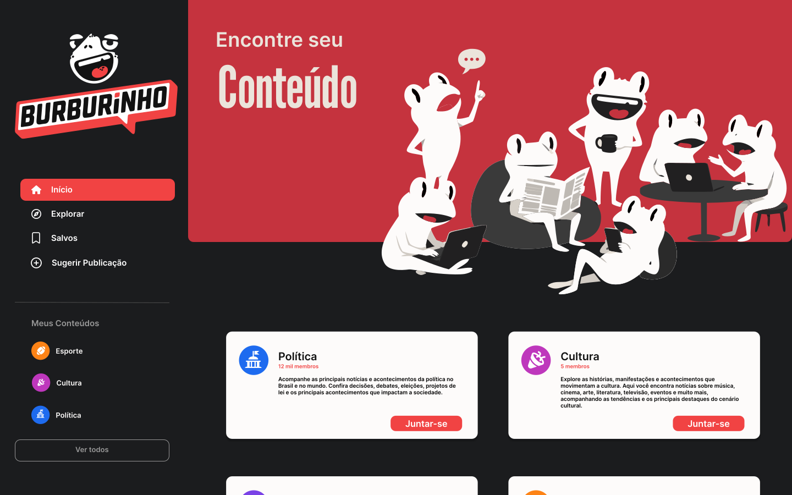
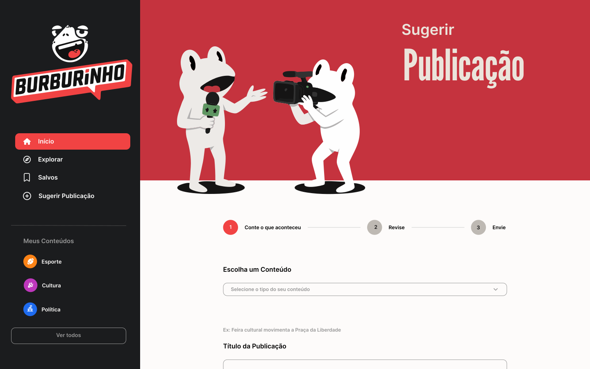

# 1.3. Iniciativas Extras (Base)

## Protótipo Navegável

Como iniciativa extra no escopo desta entrega, a equipe realizou um protótipo navegável de uma aplicação de portal de notícias, utilizando como base a análise realizada pelos três subgrupos. O protótipo consolidou os principais insights identificados nas aplicações estudadas, especialmente aqueles relacionados à organização das notícias, à experiência de navegação e à participação dos usuários. Dessa forma, foi possível transformar os resultados da análise em uma proposta visual de solução e validar a visão do grupo sobre o portal.

**Link do protótipo no Figma:** [Link do Figma](https://www.figma.com/design/LnkN55jPy6jk8dsjpmYJSF/Prot%C3%B3tipo?node-id=6-5&t=O8PEXUUSezI0o7JM-1)

## Resultados entrevista

A entrevista foi realizada através do teams, a qual o grupo mostrou o protótipo navegável da solução e indagou ao entrevistado se ele tinha alguma sugestão ou consideração sobre a página apresentada

[Gravação da reunião](https://unbbr-my.sharepoint.com/:v:/g/personal/241011170_aluno_unb_br/IQCy29iUV_0vQYwuW6dkTsl2AY1G2ZtY_7WiV_IKssAwQgI?nav=eyJyZWZlcnJhbEluZm8iOnsicmVmZXJyYWxBcHAiOiJTdHJlYW1XZWJBcHAiLCJyZWZlcnJhbFZpZXciOiJTaGFyZURpYWxvZy1MaW5rIiwicmVmZXJyYWxBcHBQbGF0Zm9ybSI6IldlYiIsInJlZmVycmFsTW9kZSI6InZpZXcifX0%3D&e=xQpPpk)

## Tela inicial deslogada
<figure style="text-align: center;">
    
    <figcaption>
        

            Figura: Tela inicial deslogada (Fonte: Equipe, 2026)
        

    </figcaption>
</figure>

Comentários:
> * **Relevância:** Trending no início é muito bom para ver em conteúdos em alta e relevantes no momento.
> * **Relevância:** Últimas notícias também é relevante para se atualizar rapidamente dos assuntos em tempo real.
> * **Compreensão:** Achou a organização da página fácil de compreender.

## Tela de acessibilidade
<figure style="text-align: center;">
    
    <figcaption>
        

            Figura: Tela de acessibilidade (Fonte: Equipe, 2026)
        

    </figcaption>
</figure>

Comentários:
> * **Acessibilidade:**  Gostou da preocupação com a acessibilidade, acredita que é algo importante e em alta nas necessidades atuais
> * **Usabilidade:** Preferiu a tela home em dark mode

## Tela de visualização da notícia
<figure style="text-align: center;">
    
    <figcaption>
        

            Figura: Tela de visualização da notícia (Fonte: Equipe, 2026)
        

    </figcaption>
</figure>

Comentários:
> * **Acessibilidade:**  Achou o tamanho da tag muito pequeno
> * **Usabilidade:** Disposição dos elementos na tela bem posicionadas
> * **Usabilidade:** Gostou das categorias, acha bom ter  um agrupador

## Tela de explorar
<figure style="text-align: center;">
    
    <figcaption>
        

            Figura: Tela de explorar (Fonte: Equipe, 2026)
        

    </figcaption>
</figure>

Comentários:
> * **Visuais:**  Elogiou as artes, disse que agrega na navegação do site
> * **Usabilidade:** Disse que comunidades/tópicos ajudam na personalização para o usuário

## Tela de categoria
<figure style="text-align: center;">
    
    <figcaption>
        

            Figura: Tela de categoria (Fonte: Equipe, 2026)
        

    </figcaption>
</figure>

Comentários:
> * **Usabilidade:** Gostou que pega a sua região para ajudar a achar eventos no fim de semana por exemplo

## Tela de salvos
<figure style="text-align: center;">
    
    <figcaption>
        

            Figura: Tela de salvos (Fonte: Equipe, 2026)
        

    </figcaption>
</figure>

Comentários:
> * **Usabilidade:** Gosta da ideia de salvar especificamente para o caso dele de tecnologias, que quando sai uma tech nova ele gostaria de salvar para testar mais tarde

## Tela de sugestão de conteúdo
<figure style="text-align: center;">
    
    <figcaption>
        

            Figura: Tela de sugestão de conteúdo (Fonte: Equipe, 2026)
        

    </figcaption>
</figure>

Comentários:
> * **Comunidade:** Gostou que cria esse senso de comunidade e que é legal para manter o site atualizado

## Comentários gerais

> * **Usabilidade:** Gostou bastante da identidade visual, um bom nome que faz a marca
> * **Navegabilidade:** Quanto ao site achou a navegabilidade fluida, elementos bem distribuídos na tela
> * **Conteúdo:** Sentiu falta de mais tipos de conteúdo/comunidades 
> * **Conteúdo:** Sentiu falta de fonte da informação, exemplo, notícias de tecnologia ele gostaria do link da empresa/fonte original
> * **Funcionalidade:** Perguntou de comentários, justificamos falando de dificuldades de como seria a moderação, e ele disse que para ele isso não seria um diferencial, mas que poderia ser para outros usuários

| Versão | Data | Descrição | Autor(es) | Revisor(es) |
| :---- | :---- | :---- | :---- | :---- |
| **0.1** | 18/08/2026 | Criação do documento iniciativas extras detalhando a entrevista | João Pedro Lopes da Cruz | Johnnatan de Salles |
