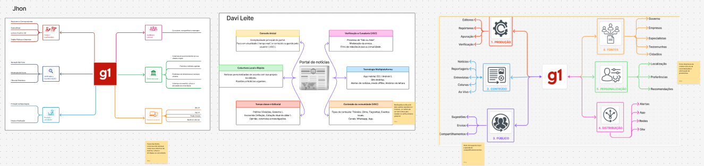
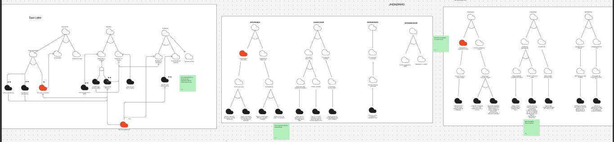
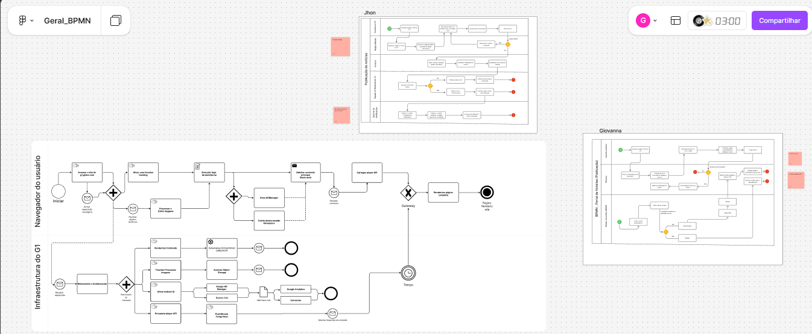

# 1. Desenho de Software (Base)

# 1.1. Relatórios

## FOCOS:

Artefatos Generalistas & NFR Framework;
Engenharia Reversa & Modelagem BPMN, e
IA Generativa.

## Introdução e metodologia

O grupo optou por cada subgrupo analisar um site específico e no final os insights principais de cada aplicação seriam consolidados em um protótipo de como a solução seria desenvolvida. Para a execução a equipe se inspirou no Design Sprint:

<figure style="text-align: center;">
    
    <figcaption>
        

            Figura: Metodologia inspirada no Design Sprint (Fonte: Equipe, 2026)
        

    </figcaption>
</figure>

A primeira reunião ([ata 1](../Projeto/Atas_1.md)) foi para a fase de mapeamento e organização do grupo, em seguida cada subgrupo se organizou para na fase de esboço desenhar os principais artefatos do projeto (generalista, BPMN da engenharia reversa, entendimentos do usa da IA e insights da aplicação analisada). Em seguida na segunda reunião geral ([ata 2](../Projeto/Atas_2.md)) foi discutido como o protótipo deveria ser direcionado e então partir para a entrevista e testagem.

## Resultados subgrupo 1

O subgrupo 1 ficou responsável pela análise do site UnB notícias, a fim de melhor compreender como que as solicitações de publicação são feitas.
### Rich Picture
<figure style="text-align: center;">
    
    <figcaption>
        

            Figura: BPMN do fluxo de processamento interno (Fonte: SubEquipe 01, 2026)
        

    </figcaption>
</figure>

Analisando o contexto da aplicação o grupo abstraiu que o portal de notícias e a secretaria de comunicação (SECOM) são o elemento central, atuando de perto com as redes sociais a fim de potencializar a comunicação das notícias. Além disso, chegamos a conclusão que a maior parte do tempo a SECOM gasta avaliando as solicitações de divulgação, se tornando um ponto importante do processo.

### BPMN
Para isso, o grupo criou dois modelos BPMN, um que representa o fluxo do processamento das solicitações, e o fluxo para entender como o usuário acha e interage com o formulário de solicitação.

<figure style="text-align: center;">
    
    <figcaption>
        

            Figura: BPMN do fluxo de processamento interno (Fonte: SubEquipe 01, 2026)
        

    </figcaption>
</figure>
<figure style="text-align: center;">
    
    <figcaption>
        

            Figura: BPMN do fluxo do solicitante (Fonte: SubEquipe 01, 2026)
        

    </figcaption>
</figure>

O fluxo de processamento se apresentou como uma grande parte da aplicação, uma vez que cada solicitação é processa individualmente, o que pode levar bastante tempo. Desse modo, o subgrupo entendeu que as qualidades de usabilidade devem se extender também para essa área da aplicação.

### SIG NFR Framework
Na parte de requisitos não funcionais o grupo entendeu que um portal de notícias foca em três qualidades principais, Usabilidade, Desempenho e Segurança:

<figure style="text-align: center;">
    
    <figcaption>
        

            Figura: Diagrama de Estimativas (Fonte: SubEquipe 02, 2026)
        

    </figcaption>
</figure>

Como pode ser observado no modelo a Usabilidade foi o critério com maior quantidade de "nuvens", mostrando a sua criticiadade para a aplicação.

---

## Resultado subgrupo 2

O subgrupo 2 ficou responsável pela análise do site dev.to, a fim de compreender melhor como comunidades são montadas e o que devemos esperar em questão de código, uma vez que a aplicação é open source.

### Diagrama de Estimativas
<figure style="text-align: center;">
    
    <figcaption>
        

            Figura: BPMN do fluxo de processamento interno (Fonte: SubEquipe 01, 2026)
        

    </figcaption>
</figure>
Para dimensionar o tamanho do projeto, traçamos um comparativo com outro já existente, o dev.to. Durante o planejamento, mapeamos detalhadamente os requisitos funcionais (como criação de comunidades) e não funcionais (como buscas instantâneas e segurança), além de estabelecermos as restrições necessárias para suportar um alto tráfego web. Por fim, fizemos as estimativas técnicas de tamanho e custo projetando o desenvolvimento de cerca de 200.000 linhas de código e utilizando o modelo COCOMO para calcular todo o esforço financeiro e de tempo da nossa aplicação.

### BPMN
Para o BPNM estruturamos 2, Um que descreve o Uso geral do sistema e outro que descreve a publicação de um artigo
<figure style="text-align: center;">
    
    <figcaption>
        

            Figura: BPMN do fluxo de Uso do sistema (Fonte: SubEquipe 02, 2026)
        

    </figcaption>
</figure>
<figure style="text-align: center;">
    
    <figcaption>
        

            Figura: BPMN do fluxo de Publicação de um Artigo (Fonte: SubEquipe 02, 2026)
        

    </figcaption>
</figure>
Estruturamos a engenharia reversa do "Fluxo de Publicação de um Artigo" por meio de um diagrama BPMN dividido em três raias de responsabilidade: as ações do Autor (Usuário), o processamento da Aplicação Core (Ruby on Rails) e as tarefas em Background Jobs (Sidekiq / Redis). Mapeamos a jornada completa, desde o momento em que o usuário escreve no editor Markdown, adiciona tags e clica em publicar, passando pela etapa do sistema que faz a limpeza, a validação (com tratamento de erro) e a persistência no banco de dados, até chegar às rotinas de segundo plano que disparam notificações para seguidores e atualizam o feed principal.

### SIG NFR Framework
<figure style="text-align: center;">
    
    <figcaption>
        

            Figura: SIG NFR Framework (Fonte: SubEquipe 02, 2026)
        

    </figcaption>
</figure>
Gráfico de Interdependência de Softgoals (SIG) para mapear os requisitos não funcionais da nossa aplicação, estruturando a separação principal com base no modelo URPS+ em Desempenho, Segurança, Usabilidade e Escalabilidade. Detalhamos soluções técnicas cruciais, como a adoção de Cache em Memória (Redis) e CDN (Fastly) para garantir baixa latência e alto throughput, a limpeza detalhada do Markdown para prevenir injeção de código (XSS) e o uso de HTML semântico aliado a atributos ARIA para garantir acessibilidade. Além disso, mapeamos os trade-offs, como o impacto negativo do Login Social OAuth na privacidade do usuário.

---

# Resultado subgrupo 3

O subgrupo 3 ficou responsável pela análise do site G1, buscando compreender a categorização e distribuição das notícias, o regionalismo da plataforma e os fluxos relacionados ao acesso e envio de conteúdos. Cada integrante elaborou os artefatos individualmente e, posteriormente, o grupo realizou uma reunião para comparar e discutir os resultados no Figma.

## Mapa Mental

Os mapas mentais foram comparados durante a reunião, destacando diferentes atores e fontes relacionados à produção e distribuição de notícias.

<figure style="text-align: center;">

    

    <figcaption>
        

            Figura: Mapas mentais individuais do Subgrupo 3 (Fonte: SubEquipe 03, 2026)
        

    </figcaption>

</figure>

[Link para o Figma - Mapa Mental](https://www.figma.com/board/4X99lA7jWijqnVVRPwsHpg/Geral_MapaMental?t=TdhIpwHQIRiQXHlO-6)

Entre os atores, foram identificados jornalistas, editores e revisores, enquanto entre as fontes foram discutidos órgãos governamentais, empresas especializadas, testemunhas e cidadãos. O grupo também discutiu a necessidade de uma etapa de curadoria antes da publicação, que poderia envolver tanto avaliação humana quanto ferramentas automatizadas, incluindo análise de malware nas mídias enviadas.

Também foi discutida a organização das notícias por temas e regiões, considerando o regionalismo como forma de direcionar o conteúdo ao público. Outros pontos levantados foram compartilhamento, recomendações e notificações para facilitar o acompanhamento das notícias.

## SIG NFR Framework

Os SIGs individuais foram comparados para discutir os requisitos não funcionais e o nível de detalhamento das suas operacionalizações.

<figure style="text-align: center;">

    

    <figcaption>
        

            Figura: SIGs NFR Framework individuais do Subgrupo 3 (Fonte: SubEquipe 03, 2026)
        

    </figcaption>

</figure>

[Link para o Figma - SIG NFR Framework](https://www.figma.com/board/O6eTws7WLuUbJ2RJGOJutV/Geral_SIG_NFR?t=TdhIpwHQIRiQXHlO-6)

Houve consenso na importância de segurança, desempenho e usabilidade para a plataforma. Entre as operacionalizações discutidas, foram levantadas a implementação de MFA para contas com privilégios de publicação e o uso de mecanismos de armazenamento em cache para sessões de autenticação.

Para o regionalismo, foram consideradas a integração com API de geolocalização no lado do cliente e a utilização de um banco de dados capaz de representar informações georreferenciadas de forma hierárquica, permitindo relacionar regiões amplas a subdivisões mais específicas.

Também foram discutidas a aplicação de tags semânticas e atributos WAI-ARIA no DOM, a utilização de CDN para arquivos estáticos e a adoção de Static Site Generation (SSG) para páginas de artigos consolidados. A partir da discussão, o grupo considerou especialmente relevantes a **acessibilidade, o carregamento das páginas e a confidencialidade dos acessos**.

## Engenharia Reversa & Modelagem BPMN

Os BPMNs foram elaborados a partir da exploração dos fluxos observáveis do G1 e posteriormente comparados entre os integrantes.

<figure style="text-align: center;">

    

    <figcaption>
        

            Figura: BPMNs individuais da Engenharia Reversa do Subgrupo 3 (Fonte: SubEquipe 03, 2026)
        

    </figcaption>

</figure>

[Link para o Figma - BPMN](https://www.figma.com/board/gOvOKqdbquiWpyIeppNXQ8/Geral_BPMN?t=TdhIpwHQIRiQXHlO-6)

Para a análise, foi utilizada a opção “Entre em contato”, que direciona para o espaço “VC no G1”, composto por diferentes subáreas relacionadas às regiões do Brasil. A partir dessa funcionalidade, foi analisado o fluxo de envio de mídias e identificada a necessidade de autenticação por meio de uma conta Globo.

Também foi analisado o fluxo de renderização e apresentação dos conteúdos ao usuário. Como o processamento interno da aplicação não pôde ser visualizado, algumas etapas foram inferidas a partir do funcionamento esperado de um portal de notícias. A discussão permitiu levantar possíveis processos internos, como validação e curadoria dos conteúdos enviados, incluindo a análise de malware antes da disponibilização das mídias.

## Resultado geral

Fizemos um protótipo para melhor alinha a visão do grupo, unindo as opiniões e análises de cada subgrupo.

| Versão | Descrição | Autor | Data | Revisor |
|:-:|:-:|:-:|:-:|:-:|
| 1.0 | Acrescenta resultados do subgrupo 1 | João Pedro Lopes da Cruz | 27/08/2026 | |
| 1.1 | Acrescenta resultados do subgrupo 2 | Matheus Eiki | 27/08/2026 | |
| 1.2 | Acrescenta resultados do subgrupo 3 | Giovanna Felipe | 27/08/2026 | |
