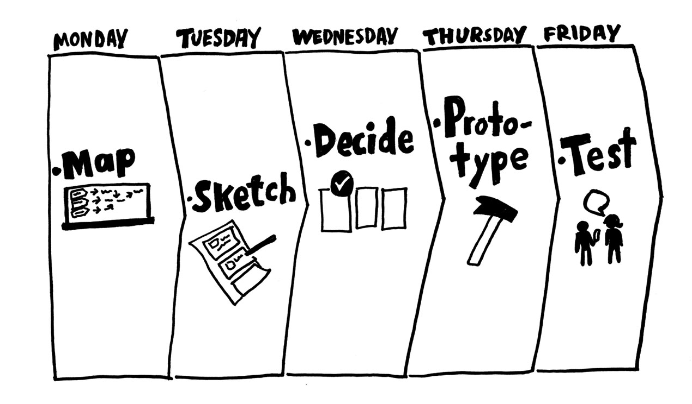

# 1. Desenho de Software (Base)

A Wiki ou GitPages do Projeto deve conter um tópico dedicado ao Módulo Desenho de Software (Base), com uma subpasta Relatórios (1.1), contendo [1.1.1](/docs/Base/Relatórios/1.1.1.SubEquipe_01.md), [1.1.2](/docs/Base/Relatórios/1.1.2.SubEquipe_02.md) e [1.1.3](/docs/Base/Relatórios/1.1.3.SubEquipe_03.md). Adicionalmente, deve constar um subtópico sobre as participações, conforme [1.2](/docs/Base/1.2.ParticipacoesBase.md). Por fim, pode constar um subtópico, chamado [1.3](/docs/Base/1.3.IniciativasExtras.md), no qual podem ser colocadas quaisquer iniciativas extras, caso ocorram (opcional). **Cada subequipe deve revelar principalmente: Rastreabilidade & Elos com Outros Artefatos, Senso Crítico, Referências, Versionamentos & Participações e Metodologia.**

# 1.1. Relatórios

# FOCOS:
Artefatos Generalistas & NFR Framework;
Engenharia Reversa & Modelagem BPMN, e
IA Generativa.

## Introdução e metodologia

O grupo optou por cada subgrupo analisar um site específico e no final os insights principais de cada aplicação seriam consolidados em um protótipo de como a solução seria desenvolvida. Para a execução a equipe se inspirou no Design Sprint:

<figure style="text-align: center;">
    
    <figcaption>
        

            Figura:Ilustração design sprint (Fonte: [Ux republic](https://www.ux-republic.com/pt/sprint-de-design-como-usar/))
        

    </figcaption>
</figure>

A primeira reunião ([ata 1](../Projeto/Atas_1.md))foi para a fase de mapeamento e organização do grupo, em seguida cada subgrupo se organizou para na fase de esboço desenhar os principais artefatos do projeto (generalista, BPMN da engenharia reversa, entendimentos do usa da IA e insights da aplicação analisada). Em seguida na segunda reunião geral ([ata 2](../Projeto/Atas_2.md)) foi discutido como o protótipo deveria ser direcionado e então partir para a entrevista e testagem.

## Resultados subgrupo 1

O subgrupo 1 ficou responsável pela análise do site UnB notícias, a fim de melhor compreender como que as solicitações de publicação são feitas.

# Resultado subgrupo 2

O subgrupo 2 ficou responsável pela análise do site dev.to, a fim de compreender melhor como comunidades são montadas e o que devemos esperar em questão de código, uma vez que a aplicação é open source.

# Resultado subgrupo 3

O subgrupo 3 ficou responsável pela análise do site G1, a fim de compreender a categorização de notícias e o regionalismo suportado pela aplicação.

# Resultado geral

Fizemos um protótipo para melhor alinha a visão do grupo, unindo as opiniões e análises de cada subgrupo.