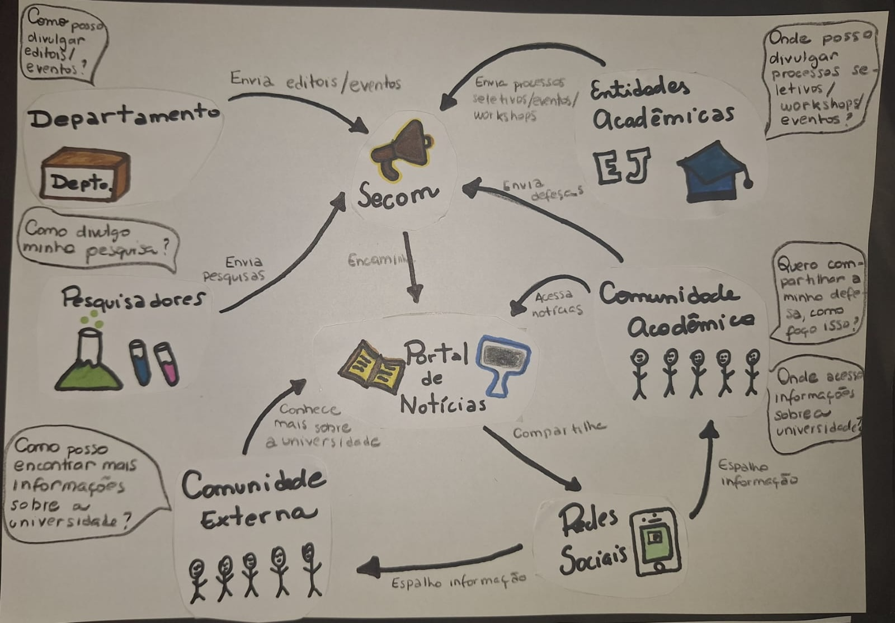
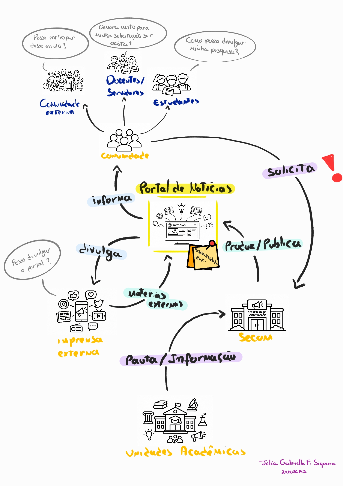
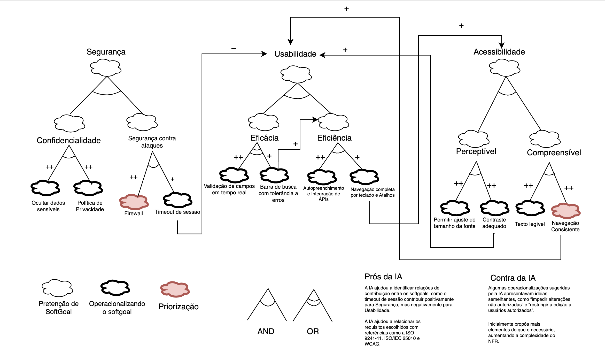
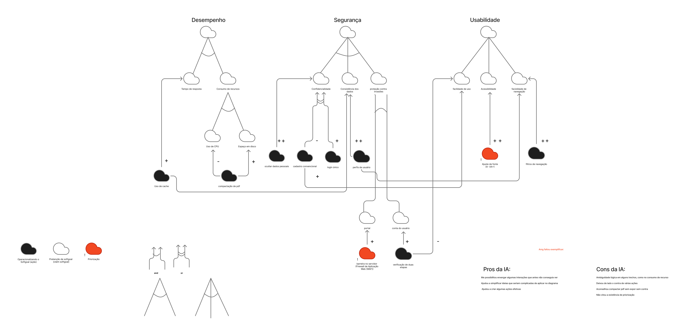
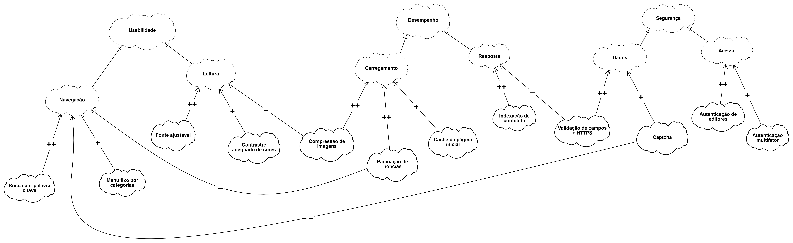

# SubEquipe_01

## Focos do Relatório
### FOCO_01: Artefatos Generalistas & NFR Framework
### Participantes no Foco_01
|Participantes|
|---------------|
| GIOVANNA AGUIAR DE BRITO | 
| JOAO PEDRO LOPES DA CRUZ | 
| JÚLIA GABRIELLA FERREIRA SIQUEIRA | 
|PEDRO HENRIQUE FERREIRA XAVIER |

### Metodologia do Foco_01
Nosso sub-grupo optou por fazer a análise direcionada para o contexo do site [UnB notícias](https://noticias.unb.br/), escolhemos essa aplicação por fazer parte de um domínio familiar e para entendermos melhor a funcionalidade dos usuários sugerirem publicações e solicitarem divulgação através dos [formulários de solicitação](https://noticias.unb.br/formularios) da plataforma.
### Rich Picture 
Rich Picture com a visão consolidada do subgrupo sobre o domínio estudado.

<figure style="text-align: center;">
    
    <figcaption>
        

            Figura: Rich Picture (Fonte: SubEquipe 01, 2026)
        

    </figcaption>
</figure>

??? note "Rich Picture Individual: João Pedro"

    <figure style="text-align: center;">
        
        <figcaption>
            

                Figura: Rich Picture Individual (Fonte: <a href="https://github.com/ojplc">João Pedro</a>, 2026)
            

        </figcaption>
    </figure>

??? note "Rich Picture Individual: Giovanna Aguiar"

    <figure style="text-align: center;">
        
        <figcaption>
            

                Figura: Rich Picture Individual (Fonte: <a href="https://github.com/giovannabrito19">Giovanna Aguiar</a>, 2026)
            

        </figcaption>
    </figure>

??? note "Rich Picture Individual: Pedro Henrique"

    <figure style="text-align: center;">
        
        <figcaption>
            

                Figura: Rich Picture Individual (Fonte: <a href="https://github.com/PedroGTG">Pedro Henrique</a>, 2026)
            

        </figcaption>
    </figure>

??? note "Rich Picture Individual: Júlia Gabriella"

    <figure style="text-align: center;">
        
        <figcaption>
            

                Figura 1: Rich Picture Individual (Fonte: <a href="https://github.com/juliagabriellafs">Júlia Gabriella</a>, 2026)
            

        </figcaption>
    </figure>

#### Insights rich picture
- O sub grupo identificou que as redes sociais estão muito entrelaçadas no contexto do jornalismo atual, e que para se obter um bom alcance o ideal seria o uso de várias plataformas para divulgação.
- Foi identificado também como os "personagens" da comunidade podem facilmente trocar de posição (estudantes podem se tornar extensionistas, docentes podem virar pesquisadores e a  comunidade externa pode se tornar docentes ou discentes, por exemplo).
- Também foi comentado que o personagem central (Secretaria de comunicação) tem um grande trabalho em garantir a qualidade e relevância das solicitações feitas pelas demais partes, se tornando assim, na opinião do subgrupo, o foco principal no desenvolvimento de uma plataforma. Tendo em vista que a SECOM passará a maior parte do tempo trabalhando no portal.

### NFR Framework
SIG dos requisitos não funcionais na notação do NFR Framework.

<figure style="text-align: center;">
    
    <figcaption>
        

            Figura: SIG NFR Framework (Fonte: SubEquipe 01, 2026)
        

    </figcaption>
</figure>

<figure style="text-align: center;">
    
    <figcaption>
        

            Figura: Legenda SIG NFR Framework (Fonte: SubEquipe 01, 2026)
        

    </figcaption>
</figure>

??? note "SIG NFR Framework individual: João Pedro"

    <figure style="text-align: center;">
        
        <figcaption>
            

                Figura: SIG NFR Framework Individual (Fonte: <a href="https://github.com/ojplc">João Pedro</a>, 2026)
            

        </figcaption>
    </figure>

??? note "SIG NFR Framework individual: Giovanna Aguiar"

    <figure style="text-align: center;">
        
        <figcaption>
            

                Figura: SIG NFR Framework Individual (Fonte: <a href="https://github.com/giovannabrito19">Giovanna Aguiar</a>, 2026)
            

        </figcaption>
    </figure>

??? note "SIG NFR Framework individual: Pedro Henrique"

    <figure style="text-align: center;">
        
        <figcaption>
            

                Figura: SIG NFR Framework Individual (Fonte: <a href="https://github.com/PedroGTG">Pedro Henrique</a>, 2026)
            

        </figcaption>
    </figure>

??? note "SIG NFR Framework individual: Júlia Gabriella"

    <figure style="text-align: center;">
        
        <figcaption>
            

                Figura 1: SIG NFR Framework Individual (Fonte: <a href="https://github.com/juliagabriellafs">Júlia Gabriella</a>, 2026)
            

        </figcaption>
    </figure>

#### Insights SIG NFR Framework
- O subgrupo concordou que a acessibildade e usabilidade são o principal requisito não funcional para o contexto, seguido pelo desempenho com o carregamento rápido das páginas
- Aspectos como pesquisa rápida/categorização do conteúdo/indexação de páginas foram a principal operacionalização do softgoal de usabilidade

### FOCO_02: Engenharia Reversa & Modelagem BPMN

### Participantes no Foco_02
|Participantes|
|---------------|
| GIOVANNA AGUIAR DE BRITO | 
| JOAO PEDRO LOPES DA CRUZ | 
| JULIA GABRIELLA FERREIRA SIQUEIRA | 
|PEDRO HENRIQUE FERREIRA XAVIER |

### Metodologia do Foco_02

Para a engenharia reversa o grupo buscou pelos fluxos principais da aplicação através da exploração do site, buscando por pontos de interação entre as diferentes camadas da solução (interação entre comunidade, instituição e visitantes).

### Processo de Engenharia Reversa Aplicado
Para a análise do site [UnB notícias](https://noticias.unb.br/), o subgrupo executou dois tipos de BPMN para o melhor entendimento do fluxo de solicitação de divulgação no site. O primeiro foco foi no solicitante, o fluxo foi montado desde o acesso ao site até o clique do botão "enviar" do formulário de solicitação. Enquanto o segundo BPMN focou em como a instituição processa as solicitações recebidas. Para a segunda análise foi usado o documento ["CRITÉRIOS DE DIVULGAÇÃO DA SECRETARIA DE COMUNICAÇÃO DA UnB"](https://noticias.unb.br/images/Noticias/Docs/2019_criterios_noticiabilidade.pdf), o qual discorre sobre o processo da solicitação de divulgação e os padrões de qualidade que devem ser seguidos pelo solicitante.

### Modelagem BPMN
Modelo, na notação BPMN, de um fluxo levantado ao realizar o processo de Engenharia Reversa.

<figure style="text-align: center;">
    
    <figcaption>
        

            Figura: BPMN fluxo do solicitante (Fonte: SubEquipe 01, 2026)
        

    </figcaption>
</figure>
<figure style="text-align: center;">
    
    <figcaption>
        

            Figura: BPMN fluxo processamento interno (Fonte: SubEquipe 01, 2026)
        

    </figcaption>
</figure>

### Insights BPMN
- Percebeu-se no fluxo do solicitante que os formulários de divulgação estão muito escondidos no UnB notícias
- O fluxo de processamento mesmo não descrevenndo em completude alguns sub processos se mostrou como o fluxo principal/maior na aplicação, levando o subgrupo a entender que o foco em usabilidade e acessibilidade deve se extender também para o fluxo de processamento, mesmo que não tenha sido possível visualizar a interface da aplicação nessa parte.
- Em discussão posterior com o grupo completo, percebemos que o calendário de publicações/calendário de eventos acessível ao público é um diferencial do UnB notícias quando comparado com outros portais de notícias (disponível em [UnBAgenda](https://noticias.unb.br/component/agenda/agendas)).

### FOCO_03: IA Generativa
### Participantes no Foco_03

| Nome do Membro | Lições Aprendidas | Uso da IA Generativa (SENSO CRÍTICO) |
| -------- | ----- | ----------- |
| JOAO PEDRO LOPES DA CRUZ | Elicitação de requisitos não funcionais  Descoberta de plataformas similares  Análise documental | O principal uso da IA foi facilitar a busca por conhecimento e contexto da solução, na forma de resumir pdfs e sugerir requisitos. A IA sugeriu algumas ideias boas como preocupação com consumo de banda e memória, escalabilidade e resistência a ataques da aplicação, sugerindo algumas ações para operacionalizar. Contudo, alguns requisitos não funcionais sugeridos foram muito genéricos, como 99,9% de disponibilidade, sendo que não se trata de uma aplicação crítica e sugeriu tempo de resposta rápido sem nenhum contexto de como implementar e testar isso.|
|GIOVANNA AGUIAR DE BRITO| Compreendi melhor a elicitação de requisitos não funcionais por meio da elaboração de um SIG utilizando o NFR Framework. Além disso, aprendi mais sobre engenharia reversa e sobre como elaborar um BPMN. A elaboração da Rich Picture também me ajudou a analisar a situação de forma mais completa. Por fim, nas discussões em grupo, consegui perceber diferentes pontos de vista sobre a nossa aplicação, o que foi importante para ampliar minha visão sobre a situação e entender melhor as necessidades envolvidas.| A IA foi utilizada para sugerir ideias de operacionalizações que contribuíssem para a satisfação das softgoals, além de esclarecer dúvidas sobre a estrutura e as notações utilizadas no NFR Framework. Ela ajudou a esclarecer algumas dúvidas e trouxe sugestões interessantes, inclusive indicando possíveis fontes de embasamento, como as normas ISO. Por outro lado, em alguns momentos, sugeriu operacionalizações que não faziam muito sentido para o contexto ou que acabavam se repetindo. Por isso, foi necessário analisar e avaliar as sugestões antes de utilizá-las no trabalho.|
| PEDRO HENRIQUE FERREIRA XAVIER | Por meio da engenharia reversa foi possível identificar os principais componentes e fluxos da aplicação, o que ajudou a compreender melhor o funcionamento do sistema e assim propor melhorias nele e contruindo uma documentação mais robusta e intuitiva no processo | A inteligencia artificial foi usada no processo de engenharia reversa para auxiliar na identificação de nuancias e detalhes no sistema, além de algumas melhorias nas quais tive que filtrar para tirar melhor proveito. Ademais, usei da IA para me auxiliar na construção dos diagramas, porém a IA não conseguiu me ajudar nem nível de abstração nem na estrutura necessária em determinados diagramas.|
| JÚLIA GABRIELLA FERREIRA SIQUEIRA | Melhor entendimento da complexidade de funcionamento do portal, envolvendo uma ampla rede de pessoas.  Organização dessa complexidade em um passo a passo claro por meio da engenharia reversa, evidenciando o modo de acesso de cada funcionalidade.  Compreensão de um conceito ainda abstrato através da elicitação de requisitos não funcionais, percebendo a interferência entre usabilidade, segurança e acessibilidade.  | A IA foi usada para sanar dúvidas sobre a construção das representações, verificando se determinado elemento deveria constar em cada diagrama. A IA auxiliou principalmente no melhor entendimento da construção do SIG NFR Framework, sugerindo, a partir de palavras-chave, operacionalizações como validação de campos, que foram mantidas por se mostrarem soluções voltadas à otimização da navegação, da leitura e do acesso da comunidade, sem comprometer a agilidade do desenvolvimento. Por outro lado, algumas propostas foram descartadas por fugirem do escopo focado na interface ou por adicionarem atrito e complexidade desnecessários à representação. |

## Versionamentos
|Nome do Membro | Contribuição | Data
| -------- | ----- | ----------- |
| Joao Pedro Lopes da Cruz | Acrescenta artefatos individuais e o ponto de vista do subgrupo que foi discutido em reunião prévia | 26/08/2026 |
| Giovanna Aguiar de Brito | Acrescenta artefatos individuais, lições aprendidas e ponto de vista sobre IA Generativa | 26/08/2026
| Pedro Henrique Ferreira Xavier | Acrescenta artefatos individuais e completa o FOCO_03 com lições aprendidas e ponto de vista sobre IA Generativa | 26/08/2026 |
| Júlia Gabriella Ferreira Siqueira | Acrescenta artefatos individuais, Rich Picture Geral, lições aprendidas e ponto de vista sobre IA Generativa | 27/08/2026 |