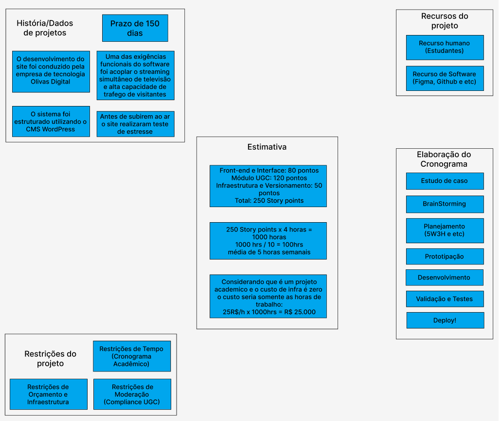
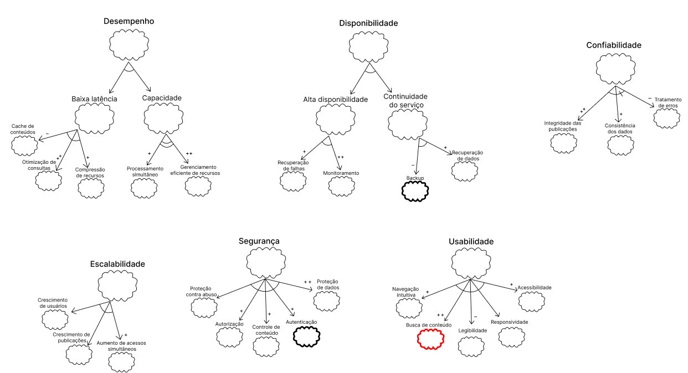
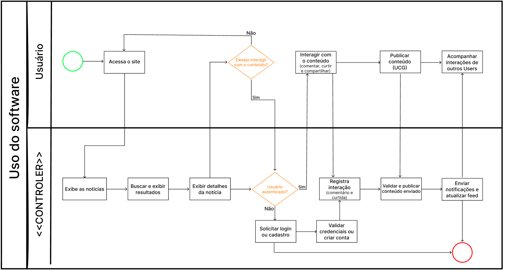

# SubEquipe_02

## Focos do Relatório

### FOCO_01: Artefatos Generalistas & NFR Framework

**Entrega Mínima:** um artefato generalista (Rich Picture ou Mapa Mental) e um SIG na notação do NFR Framework.

### Participantes no Foco_01
| Luís Felipe Parreira Cunha |
| André Henrique de Souza Belarmino |
| Matheus Eiki Kimura Rezende |

### Luís Felipe Parreira Cunha
---
### Metodologia do Foco_01
Cada integrante elaborou individualmente sua versão do Diagrama de Estimativas e do SIG, com apoio de IA Generativa como ferramenta de brainstorming e estruturação. As versões individuais foram posteriormente comparadas e consolidadas em um artefato único da equipe.

### Diagrama de Estimativas

O artefato generalista escolhido foi o **Diagrama de Estimativas**, reunindo:

- **História/Dados do Projeto**: stack tecnológica do Forem (Ruby on Rails no backend, Preact/Vanilla JS no frontend, PostgreSQL, Varnish, Sendgrid, Fastly), classificado como projeto *open source* e *User Generated Content*.
- **Estimativa de Tamanho**: aproximadamente 200.000 linhas de código para toda a plataforma (frontend, backend, servidor, testes e estilização), com cobertura de testes de 49% no frontend e indicação de que o backend deveria priorizar 80% em Rails.
- **Requisitos Funcionais e Não Funcionais**: levantamento de funcionalidades (criar posts, comunidades, conta, seções de posts em alta, algoritmo de recomendação) e requisitos não funcionais (busca instantânea, acesso simultâneo, HTTPS, cache de páginas para usuários deslogados, proteção contra XSS, dark mode).
- **Recursos de Projeto**: comparação entre os números reais do Forem/dev.to (4 anos de duração, +16.000 pull requests, +5.800 issues, +14.800 commits na main, 745 contribuidores) e o dimensionamento estimado da nossa equipe (10 desenvolvedores full stack, 2 mobile, 4 meses de projeto).
- **Estimativa de Custo**: aplicação do **Modelo COCOMO** em três cenários de complexidade (orgânico, semi-destacado e embutido) para 250 KLOC, comparando esforço estimado (pessoas-mês) e duração de desenvolvimento.
- **Restrições do Projeto**: aplicação web, suporte a alto número de acessos simultâneos, suporte a comunidades de usuários com interesses em comum.

**Justificativa do uso de IA:**
- *Pontos positivos*: ajudou a definir requisitos não funcionais de difícil elicitação, trouxe dados válidos e executáveis (o repositório poderia ser rodado localmente) e sugeriu uma calculadora de estimativas COCOMO útil para a estimativa de custo.
- *Pontos negativos*: gerou exemplos de requisitos genéricos demais, com valores aleatórios de quantidade de usuários e frases vagas como "mais rápido", "ser responsivo" e "manter uma cobertura de testes eficiente"; foram necessárias várias tentativas até a IA compreender corretamente o que estava sendo pedido para o diagrama de estimativas.

### NFR Framework

SIG (*Softgoal Interdependency Graph*) de **Desempenho, Segurança e Usabilidade**, na notação do NFR Framework, usando **URPS+** como categoria das nuvens principais de qualidade:

- **Desempenho** → Baixa Latência no Carregamento (TTFB) e Alto Throughput, operacionalizados por: Cache em Memória (Redis) `++`, Uso de CDN/Fastly `+` e Processamento Assíncrono via Sidekiq/Redis `++`. O Cache em Memória também contribui `+` para o softgoal de **Escalabilidade**, junto de Índices Otimizados no Banco `+` e Réplicas de Leitura no PostgreSQL `+`.
- **Segurança** → Prevenção contra Injeção de Código (XSS), Autenticação Segura e Privacidade. A Limpeza detalhada do Markdown (pipeline de renderização) contribui `+` para prevenção de XSS; o Login Social OAuth contribui `+` para Autenticação Segura, mas impacta negativamente `-` a Privacidade — um trade-off explícito no grafo.
- **Usabilidade** → Acessibilidade (a11y) e Boa Experiência de Leitura. Uso de HTML Semântico `++` e atributos ARIA `++` contribuem para a11y; Suporte Nativo a Temas (Dark Mode/Light Mode) `+` contribui para a experiência de leitura.

**Justificativa do uso de IA:**
- *Pontos positivos*: a IA ajudou na separação principal usando URPS+, indicou operacionalizações (softgoals filhos/claims) e exemplos de claims para cada categoria do URPS+, com explicação do motivo de cada uma.
- *Pontos negativos*: não classificou nenhuma claim como "Funcionalidade", mesmo havendo algumas que claramente pertenciam a essa categoria; sugeriu, de forma inválida, um filho com mais de uma seta apontando para o mesmo pai; e deixou de fora alguns claims relevantes, como o de privacidade — que precisou ser adicionado manualmente com o trade-off negativo do Login Social OAuth.

---
### André Henrique de Souza Belarmino

### Diagrama de Estimativas

A análise foi feita por **módulos do sistema**: para cada módulo, somei o tempo de desenvolvimento estimado em frontend, backend, banco de dados, integração e documentação, com foco em entender quais funcionalidades seriam viáveis de entregar dentro do prazo estimado da matéria.

**Requisitos** (levantados na Engenharia Reversa do dev.to)
- *Funcionais*: criar posts; receber avisos sobre criação de post; criar comunidades; exibir feed de artigos mais engajados; interagir com publicações; seguir tags; gerenciar lista de leitura; recomendar publicações personalizadas baseadas no histórico; criar conta; realizar login OAuth; ver conta; atualizar conta; deletar conta.
- *Não funcionais*: pesquisar instantaneamente tópicos ou posts; suportar acesso simultâneo; proteger o site com HTTPS para acesso seguro de dados; armazenar páginas públicas em cache na parte de Edge para usuários deslogados; evitar ataques Cross Site Scripting em artigos e comentários publicados; suportar Dark mode.

**Cálculo da Capacidade**
- Tamanho da equipe: 10 estudantes.
- Dedicação: 10 horas semanais por membro.
- Capacidade de produção da equipe: 100 horas por semana.
- Tempo total viável: 100h × 15 semanas (prazo da entrega final) = **1.500h** de esforço total disponíveis.

**Estimativa Custo x Prazo x Entrega**
Foi estabelecida uma matriz de complexidade que justifica a carga horária considerando o ciclo de vida completo de cada funcionalidade — modelagem do banco de dados, construção da API no backend, desenvolvimento dos componentes no frontend e testes integrados:
- *Baixa (~40h)*: funcionalidades de fluxo direto (CRUD básico), interfaces simples e persistência em tabelas sem relacionamentos complexos.
- *Média (~80h)*: validações rigorosas de regras de negócio, queries com múltiplos relacionamentos no banco relacional ou integração com serviços de terceiros (ex.: APIs de autenticação).
- *Alta (~130h)*: algoritmos específicos, sanitização complexa de dados (ex.: um parser de Markdown seguro contra injeção de código) ou processamento e envio de notificações.

A estimativa também pressupõe que as horas disponíveis da equipe absorvam o esforço contínuo de revisão de *pull requests*, documentação e alinhamento do time (Fator Estrutural), concentrado no Módulo 5:

| Módulo | Escopo | Horas |
|---|---|---|
| 1 – Gestão de Contas | Criar, ver, atualizar, deletar conta; realizar login OAuth | ~200h |
| 2 – Autoria e Conteúdo | Criar posts; criar comunidades; gerenciar lista de leitura | ~300h |
| 3 – Engajamento Social | Interagir com publicações; seguir tags; receber avisos | ~300h |
| 4 – Descoberta (Feeds) | Recomendar publicações personalizadas; feed em alta | ~250h |
| 5 – Arquitetura e Qualidade | Configuração dos bancos, CI/CD, testes e análise de qualidade (esforço transversal do time ao longo das 15 semanas) | ~400h |
| **Total** | | **1.450h estimadas** |

**Conclusão da estimativa:** o levantamento resulta em um esforço total estimado de 1.450 horas, o que valida a execução integral do escopo dentro da capacidade produtiva da equipe (1.500 horas projetadas para o ciclo de 15 semanas).

### NFR Framework

SIG (*Softgoal Interdependency Graph*) construído a partir da leitura dos requisitos não funcionais do próprio dev.to, selecionando os pertinentes ao nosso projeto e organizando-os em cinco softgoals de topo, cada um decomposto por relação **AND** em sub-softgoals (notação de CHUNG et al., 1999):

- **Desempenho** → Baixa Latência e Alto Throughput, operacionalizados por *Uso de CDN (Fastly)* `++` e *Processamento Assíncrono (Sidekiq/Redis)* `+`. O Uso de CDN também contribui `++` para a Continuidade do Serviço, um impacto cruzado entre Desempenho e Disponibilidade.
- **Segurança** → Prevenção contra Injeção de Código (XSS), Autenticação Segura e Privacidade. A *Limpeza detalhada do Markdown* (pipeline de renderização) contribui `+` para a prevenção de XSS, mas impacta negativamente `-` a Navegação via Turbo/Hotwire (trade-off Segurança × Usabilidade); o *Login Social OAuth* contribui `+` para Autenticação Segura, mas `-` para Privacidade — trade-off interno ao próprio softgoal de Segurança.
- **Usabilidade** → Navegação Fluida e Conforto Visual, operacionalizados por *Navegação via Turbo/Hotwire* `++`, *HTML Semântico* `+` e *Suporte a Temas Claro e Escuro* `+`.
- **Disponibilidade** → Continuidade do Serviço e Recuperação de Dados, operacionalizada por *Backup do Banco de Dados* `++`.
- **Escalabilidade** → operacionalizada por *Índices Otimizados no Banco* `+` e *Réplicas de Leitura no PostgreSQL* `+`.

Os dois links de contribuição negativa (`-`) do grafo — OAuth × Privacidade e Limpeza do Markdown × Navegação — ficaram sem uma *Claim Softgoal* documentando a decisão de aceitar esse risco, o que fica registrado como ponto de melhoria para uma próxima iteração do modelo.

---
### Matheus Eiki Kimura Rezende
### Diagrama de Estimativas

**Justificativa do uso de IA:**
- *Pontos positivos*: Foi utilizada para realizar pesquisas e discutindo sobre estimativas
- *Pontos negativos*: As fontes utilizadas eram com base em dados antigos e de paginas que sem o uso de site atemporais (como o wayback machine) eram inviavé realizar as verificações

### NFR Framework

Principais Requisitos Mapeados
O sistema foi analisado sob seis grandes pilares (Softgoals):

Desempenho: Dividido na necessidade de manter a Baixa latência (velocidade) e a Capacidade do sistema. Soluções como a otimização de consultas e o gerenciamento eficiente ajudam fortemente a atingir essa meta.

Disponibilidade: Focado em manter o sistema no ar e garantir a continuidade. Depende de fatores como monitoramento e recuperação de falhas.

Confiabilidade: Busca garantir que as publicações e os dados sejam íntegros e consistentes.

Escalabilidade: Prepara o sistema para crescer, lidando com o aumento de usuários, de publicações e de acessos simultâneos.

Segurança: Mapeia a necessidade de proteger dados e evitar abusos. A Autenticação ganha destaque como uma ação técnica central.

Usabilidade: Foca na experiência do usuário, incluindo navegação, acessibilidade e responsividade.
**Justificativa do uso de IA:**
- Nessa atividade não utilizei de IA
---

### FOCO_02: Engenharia Reversa & Modelagem BPMN

**Entrega Mínima:** um modelo, na notação BPMN, do fluxo do software encontrado com a Engenharia Reversa.

### Participantes no Foco_02
| Luís Felipe Parreira Cunha |
| André Henrique de Souza Belarmino |
| Matheus Eiki Kimura Rezende|

### Luís Felipe Parreira Cunha
---
### Metodologia do Foco_02
Aplicação individual do processo de Engenharia Reversa sobre o Forem, com posterior consolidação do fluxo em um único modelo BPMN de equipe.

### Processo de Engenharia Reversa Aplicado

A Engenharia Reversa foi aplicada sobre o **Forem**, projeto open source que constitui a plataforma por trás do **dev.to**. Como parte da investigação do código, foi executada a suíte de testes (Jest) do projeto e analisados os resultados frente aos limiares (*thresholds*) de cobertura configurados, além de localizar os dados de cobertura de testes publicados no Codecov do projeto — informações que também alimentaram a estimativa de qualidade/tamanho registrada no Mapa Mental do Foco_01. A partir da leitura do código-fonte, da estrutura de pastas (separação entre aplicação Core em Ruby on Rails, jobs assíncronos via Sidekiq/Redis e camada de apresentação) e do comportamento observado da aplicação, foi recuperado o fluxo de publicação de um artigo (post).

*(Espaço para detalhar melhor as ferramentas específicas utilizadas e embasar o processo na literatura de Engenharia Reversa.)*

### Modelagem BPMN
Modelo BPMN do fluxo **"Publicação de um Artigo"**, organizado em três raias (pools/lanes):

1. **Autor (Usuário)** — evento de início → Escreve um post ("Write a Post") → Abre editor Markdown → Adiciona Capa e Tags → Clica em Publicar; ao final do fluxo, Visualiza o post → evento de fim.
2. **Aplicação Core (Ruby on Rails)** — Limpeza e Parser do Markdown → gateway de decisão *Validação do conteúdo/tag*: se inválido, retorna mensagem de erro (evento de fim de erro); se válido, persiste no Banco de Dados → atualiza cache no Redis.
3. **Background Jobs (Sidekiq/Redis)** — Dispara notificação para seguidores → Atualiza algoritmo do feed principal → Executa Cross-posting em outras plataformas → retorna o controle para o Autor visualizar o post publicado.

**Justificativa do uso de IA:**
- *Pontos positivos*: gostei da sugestão de trabalhar com o fluxo de criação de post, da separação das raias por responsabilidade e da definição clara de ação de início e ação de fim.
- *Pontos negativos*: o trajeto sugerido pelo diagrama ficou confuso demais, sendo necessário ajustar manualmente atividade por atividade; uma versão inicial ficou setorizada demais, sem conexões claras entre as raias.

---
### André Henrique de Souza Belarmino

### Processo de Engenharia Reversa Aplicado
A Engenharia Reversa foi aplicada sobre a funcionalidade de **seguir uma tag (comunidade)** do dev.to, em três etapas: (1) navegação funcional pela aplicação, deslogado e logado, observando o comportamento ao tentar seguir uma tag; (2) inspeção das requisições via DevTools do navegador, identificando respostas de *Turbo Stream* (indício de Hotwire) e um atraso perceptível entre a ação de seguir e a atualização do feed (indício de processamento em segundo plano); (3) inferência de que a escrita do "follow" ocorre de forma síncrona na aplicação Core (Ruby on Rails), enquanto a invalidação de cache e a reconstrução do feed ocorrem de forma assíncrona via Sidekiq/Redis — achado consistente com o *Processamento Assíncrono* já modelado no SIG do FOCO_01.

### Modelagem BPMN

Modelo BPMN do fluxo **"Seguir uma Tag (Comunidade)"**, em um único *pool* ("Dedenet"), com três raias e atividades nomeadas com verbo na 3ª pessoa do singular (notação vista em aula):
1. **Autor (Usuário)** — evento de início → *Busca a tag* → *Abre a página* → *Faz o login* (somente se necessário) → *Segue a tag* → *Vê o feed* → evento de fim.
2. **Aplicação Core (Ruby on Rails)** — *Carrega a tag* → *gateway exclusivo* **"Autenticado?"** (Não → retorna para *Faz o login*; Sim → segue para *Segue a tag*) → *Cria o follow* → *Limpa o cache*.
3. **Background Jobs (Sidekiq/Redis)** — *Refaz o Feed* → devolve o controle para *Vê o feed*.

Optei por um **gateway exclusivo** — e não inclusivo ou paralelo — no ponto de decisão "Autenticado?" porque a condição é mutuamente excludente (o usuário está autenticado **ou** não, nunca as duas ao mesmo tempo). Colocar os *background jobs* em raia própria, separada da aplicação core, torna explícita no BPMN a mesma decisão de arquitetura registrada no SIG do FOCO_01 (uso de processamento assíncrono para não bloquear a resposta ao usuário), amarrando os dois artefatos do relatório.

---
### Matheus Eiki Kimura Rezende
### Processo de Engenharia Reversa Aplicado

Estrutura do Diagrama (Raias/Swimlanes)
O processo é dividido em dois atores principais, representados pelas linhas horizontais:
Usuário: Representa as ações ativas e decisões tomadas pela pessoa que está navegando no site.
<>: Representa o backend ou o sistema do software, responsável por processar as requisições do usuário, exibir dados e gerenciar regras de negócio.
Simbologia Utilizada
Círculo Verde: Indica o Início do processo (quando o usuário acessa a plataforma).
Círculo Vermelho: Indica o Fim do fluxo do processo desenhado.
Retângulos: Representam as Tarefas ou ações executadas por cada ator (ex: "Exibe as notícias", "Solicitar login").
Losangos Laranjas (Gateways): Representam Pontos de Decisão. O fluxo se divide dependendo da resposta (Sim ou Não).
Descrição do Fluxo Passo a Passo
Acesso Inicial: O fluxo começa quando o Usuário "Acessa o site".
Exibição de Conteúdo: O Controler reage imediatamente exibindo as notícias, processando buscas e mostrando os detalhes da notícia selecionada.
Decisão de Interação: O usuário chega ao primeiro ponto de decisão: "Deseja interagir com o conteúdo?".
Se a resposta for Não, o fluxo retorna para a navegação normal (Acessa o site).
Se a resposta for Sim, o fluxo desce para o sistema.
Verificação de Autenticação: O sistema (Controler) verifica: "Usuário autenticado?".
Se Não, o sistema exige uma ação: "Solicitar login ou cadastro" e, em seguida, valida as credenciais ou cria a conta antes de permitir a interação.
Se Sim, o fluxo avança direto.
Interação e Publicação: Com o usuário logado, ele pode "Interagir com o conteúdo" (comentar, curtir, compartilhar). O Controler "Registra a interação".
Geração de Conteúdo (UGC): O usuário pode também "Publicar conteúdo (UGC)". O sistema recebe, valida e publica esse material.
Atualização e Fim: O sistema "Envia notificações e atualiza o feed", permitindo que o usuário acompanhe as interações de outros. Após essa etapa de atualizações pelo sistema, o fluxo chega ao seu término (círculo vermelho).

---
### FOCO_03: IA Generativa

**Entrega Mínima:** pontos de vista de cada membro da equipe sobre as lições aprendidas e uso da IA Generativa.

#### Imagem do foco
Nenhuma imagem específica foi adicionada para este foco no momento.

### Participantes no Foco_03
| Luís Felipe Parreira Cunha | Lições Aprendidas | Uso da IA Generativa (SENSO CRÍTICO) |
|---|---|---|
| Luís Felipe Parreira Cunha | Compreendi na prática o processo de Engenharia Reversa, aplicando-o sobre o Forem (código aberto por trás do dev.to) para recuperar o fluxo de publicação de artigos e representá-lo em BPMN, com raias separadas para Usuário, Aplicação Core e Background Jobs. Também elaborei um SIG na notação do NFR Framework, usando URPS+ como categorização principal das nuvens de qualidade, decompondo Desempenho, Segurança e Usabilidade em claims operacionalizáveis com contribuições `+`/`++`/`-`. Para o artefato generalista, construí um Diagrama de Estimativas reunindo dados históricos do projeto, estimativa de tamanho (~200 mil linhas de código), requisitos funcionais/não funcionais e estimativa de custo pelo modelo COCOMO em três cenários de complexidade. | A IA foi útil como ponto de partida — sugeriu estruturas (raias no BPMN, URPS+ como categorização do SIG), operacionalizações de requisitos difíceis de elicitar e até uma calculadora de estimativas COCOMO. Por outro lado, cometeu erros que exigiram correção manual embasada: no BPMN, o traçado ficou confuso e precisei reorganizar conexões à mão; no SIG, deixou de classificar claims claramente de "Funcionalidade", sugeriu uma estrutura inválida (duas setas de um filho para o mesmo pai) e omitiu o claim de privacidade; no diagrama de estimativas, trouxe requisitos genéricos demais (valores aleatórios, "mais rápido", "ser responsivo") e precisou de várias iterações até entender corretamente o pedido. Isso reforçou a importância de validar toda saída da IA com base técnica e senso crítico antes de incorporá-la ao artefato final. |
| André Henrique de Souza Belarmino | Aplicar a Engenharia Reversa sobre um fluxo específico (seguir uma tag/comunidade) me mostrou, na prática, a mesma separação de responsabilidades que os demais colegas encontraram em seus fluxos: usuário, aplicação Core (Rails) e Background Jobs (Sidekiq/Redis) são raias com fronteiras bem definidas, e representar isso em BPMN exige decidir corretamente o tipo de gateway (no meu caso, exclusivo, por a autenticação ser mutuamente excludente). No Diagrama de Estimativas, dividir o esforço por módulos do sistema (front, back, banco, integração) foi um exercício parecido com o "choque de realidade" sobre gestão de tempo: a folga de apenas ~3% entre o esforço estimado (1.450h) e a capacidade da equipe (1.500h) deixou claro que decisões de escopo têm custo real e que esforços "transversais" (arquitetura, qualidade) são fáceis de subestimar. Já o SIG me ensinou, assim como para os colegas, que arquitetura é negociação de trade-offs: o Login Social OAuth melhora a Autenticação mas piora a Privacidade, e uma sanitização de Markdown mais rigorosa (boa para Segurança) piora a fluidez da navegação via Turbo/Hotwire — trade-offs que só ficam visíveis quando modelados explicitamente no grafo. | Usei a IA principalmente como apoio na organização e redação do relatório a partir dos meus próprios artefatos (Estimativa, SIG e BPMN já desenhados por mim), e não para gerar os diagramas do zero. Ainda assim, precisei checá-la com cuidado: em alguns momentos ela confundia os tipos de contribuição do NFR Framework (`Make`/`Help`/`Hurt`) com a terminologia do URPS+, e tendia a generalizar demais a justificativa de escolhas de notação (ex.: por que usar gateway exclusivo e não inclusivo) até eu pedir que embasasse a resposta diretamente nos slides da disciplina. Isso reforçou, na prática, o mesmo ponto que o Luís levantou: a saída da IA precisa ser validada com base técnica antes de entrar no artefato final. |
| Matheus Eiki | Olhar para esses artefatos finalizados me faz perceber o quanto o desenvolvimento de um software vai muito além de apenas escrever código. Elaborar o planejamento, mapear os processos e analisar os requisitos me forçou a adotar uma visão sistêmica e madura sobre o ciclo de vida do projeto. 1. O Fluxo e a Fronteira de Responsabilidades Ao desenhar o BPNM, a maior lição foi entender a separação rigorosa entre a experiência do usuário e as obrigações do sistema (o "CONTROLER"). 2. A Realidade do Gerenciamento e Custos A construção do quadro Estimativa foi um verdadeiro choque de realidade sobre gestão de tempo e valor. O Valor do Tempo: Converter 250 Story Points em 1000 horas de trabalho me fez dimensionar o tamanho do esforço. Mais importante, ao precificar a hora de trabalho, cheguei ao valor de R$ 25.000. Isso me ensinou que, mesmo em um projeto acadêmico onde o custo de infraestrutura inicial possa ser zero, o recurso humano (nosso tempo) tem um valor financeiro real e altíssimo. Restrições: Mapear o cronograma acadêmico e as regras de moderação (Compliance UGC) logo no início foi crucial para não prometer um escopo impossível de ser entregue no prazo de 150 dias. 3. Os Conflitos da Arquitetura O desenvolvimento do SIG NFR me ensinou que arquitetura de software é sobre negociar perdas e ganhos (trade-offs). Impactos Negativos: Foi interessante mapear como a necessidade de Continuidade do serviço (Disponibilidade) sofre um impacto negativo momentâneo das rotinas de Backup, algo que muitas vezes esquecemos na fase de planejamento. Pontos de Atenção: Destacar a Busca de conteúdo em vermelho e a Autenticação em bordas grossas me ajudou a priorizar quais funcionalidades exigiriam mais cuidado técnico para garantir a usabilidade e a segurança do projeto final. | Utilizei a IA mais para realizar pesquisas, pois estava com tempo e queria criar do zero, então não tenho críticas sobre uma geração de artefato utilizando |

---

## Versionamentos

| Nome do Membro | Contribuição | Data |
|---|---|---|
| Luís Felipe Parreira Cunha | 1. Elaboração do Diagrama de Estimativas, do SIG do NFR Framework (URPS+) e do Modelo BPMN do fluxo de publicação de artigos, com ponto de vista sobre Engenharia Reversa e uso de IA Generativa | 26/08/2026 |
| André Henrique de Souza Belarmino | 1. Elaboração do Diagrama de Estimativas, do SIG do NFR Framework e do Modelo BPMN do fluxo de seguir uma tag (comunidade) | 27/08/2026 |
| Matheus Eiki | 1. Elaboração do Diagrama de Estimativas, do SIG do NFR Framework (URPS+) e do Modelo BPMN do fluxo de publicação de artigos, com ponto de vista sobre Engenharia Reversa e uso de IA Generativa| 26/08/2026 |