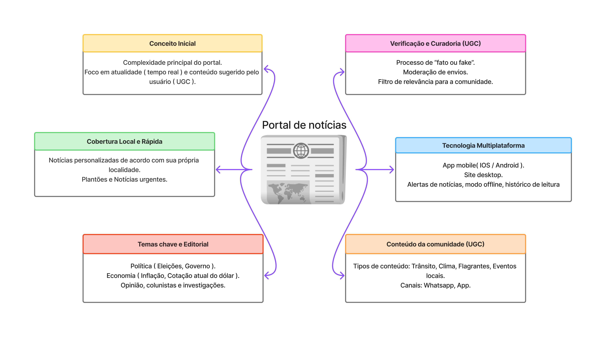
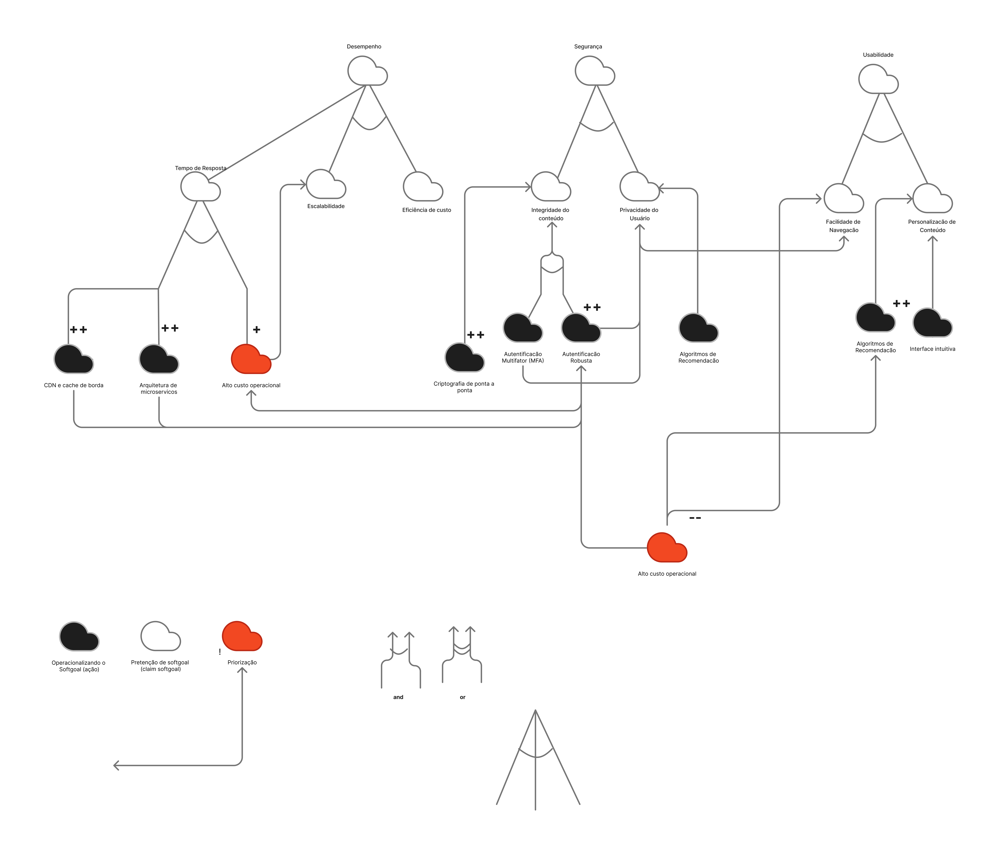

# SubEquipe_03

## Focos do Relatório:
### FOCO_01: Artefatos Generalistas & NFR Framework
### Participantes no Foco_01
| Participantes |
|---------------|
|DAVI GONCALVES LEITE FEITOSA|
|GIOVANNA FELIPE GUIMARAES|
|JOHNNATAN DE SALLES SANCHES|

### Metodologia do Foco_01

Nosso sub-grupo optou por fazer a análise direcionada para o contexto do site [G1](https://g1.globo.com/), escolhido por ser uma plataforma de notícias conhecida no Brasil todo e por permitir analisar diferentes aspectos da produção e distribuição de conteúdo jornalístico.

Registro da reunião em: [Ata 1 - subgrupo 3](../../Projeto/Atas_subgrupo_3.md)

### Mapa Mental

??? note "Mapa Mental Individual: Giovanna Felipe Guimarães"

    <figure style="text-align: center;">
        
        <figcaption>
            

                Figura : Rich Picture Individual (Fonte: <a href="https://github.com/giovannafg">Giovanna Felipe</a>, 2026)
            

        </figcaption>
    </figure>

??? note "Rich Picture Individual: Johnnatan de Salles"

    <figure style="text-align: center;">
        
        <figcaption>
            

                Figura: Mapa Mental Individual (Fonte: <a href="https://github.com/jsalless">Johnnatan de Salles</a>, 2026)
            

        </figcaption>
    </figure>

??? note "Rich Picture Individual: Davi Goncalves Leite Feitosa"

    <figure style="text-align: center;">
        
        <figcaption>
            

                Figura: Mapa Mental Individual (Fonte: <a href="https://github.com/Withy-S">Davi Goncalves Leite Feitosa</a>, 2026)
            

        </figcaption>
    </figure>

#### Insights Mapa Mental
- Os mapas mentais apresentaram diferentes atores e fontes envolvidos na produção de notícias, com disposições diferentes, mas que se complementaram bem na análise da plataforma.
- Foi identificado que é importante que um portal de notícias tenha uma definição clara dos temas abordados, orientando a organização e a cobertura do conteúdo. Entre os temas analisados no G1 estão política, economia, opinião e investigações. Davi também destacou a presença de eventos, cultura e atividades da comunidade, considerada relevante pelo grupo. Foi discutido ainda que o G1 apresenta atalhos na navbar para diferentes conteúdos.
- Johnnatan identificou a possibilidade de notificações push para informar os usuários sobre novas notícias, facilitando o acompanhamento de conteúdos recentes.
- Giovanna destacou que as notícias possuem atalhos de compartilhamento e envio, além da importância de considerar recomendações e distribuição de conteúdo de acordo com as preferências dos usuários.

### NFR Framework
SIG de requisitos não funcionais na notação do NFR Framework.

??? note "SIG NFR Framework Individual: Giovanna Felipe"

    <figure style="text-align: center;">
        
        <figcaption>
            

                Figura : SIG NFR Framework Individual (Fonte: <a href="https://github.com/giovannafg">Giovanna Felipe</a>, 2026)
            

        </figcaption>
    </figure>
#

??? note "SIG NFR Framework Individual: Johnnatan de Salles"

    <figure style="text-align: center;">
        
        <figcaption>
            

                Figura: SIG NFR Framework Individual (Fonte: <a href="https://github.com/jsalless">Johnnatan de Salles</a>, 2026)
            

        </figcaption>
    </figure>
#

??? note "SIG NFR Framework Individual: Davi Goncalves Leite Feitosa"

    <figure style="text-align: center;">
        
        <figcaption>
            

                Figura: SIG NFR Framework Individual (Fonte: <a href="https://github.com/Withy-S">Davi Goncalves Leite Feitosa</a>, 2026)
            

        </figcaption>
    </figure>

#

#### Insights SIG NFR Framework
- O subgrupo se reuniu para discutir os três principais requisitos identificados: segurança, desempenho e usabilidade, percebendo que os integrantes estavam alinhados quanto à sua importância para a plataforma.
- O grupo considerou relevante a contextualização geográfica para personalizar o conteúdo apresentado aos usuários, contribuindo para a usabilidade sem comprometer a segurança.
- A principal dificuldade encontrada foi na definição do nível de detalhamento das nuvens, sendo observado que alguns integrantes detalharam mais as operacionalizações do que outros, devido às diferentes interpretações sobre o nível de abstração esperado.

### FOCO_02: Engenharia Reversa & Modelagem BPMN
### Participantes no Foco_02
| Participantes |
|---------------|
|DAVI GONCALVES LEITE FEITOSA|
|GIOVANNA FELIPE GUIMARAES|
|JOHNNATAN DE SALLES SANCHES|
### Metodologia do Foco_02

Registro da reunião em: [Ata 1 - subgrupo 3](../../Projeto/Atas_subgrupo_3.md)

### Processo de Engenharia Reversa Aplicado

O processo de engenharia reversa foi conduzido através de uma análise sistemática da plataforma G1, com o objetivo de decomposição funcional e identificação dos fluxos de negócio envolvidos na distribuição de conteúdo jornalístico. A estratégia adotada focou em dois fluxos principais:

1. **Fluxo de Apresentação de Conteúdo**: Análise de como as notícias são organizadas, navegadas e apresentadas ao usuário final, considerando a estrutura de categorias, personalização de conteúdo e recomendações.

2. **Fluxo de Submissão de Conteúdo**: Exploração dos mecanismos por meio dos quais usuários e produtores externos podem contribuir com conteúdo, particularmente através da funcionalidade "VC no G1", que oferece diversos canais regionais para envio de mídias.

Durante a exploração, o grupo mapeou os pontos-chave de interação entre usuários e o sistema, identificando transações críticas, fluxos de dados, validações necessárias e possíveis processos internos (como análise de segurança de mídia) que, embora não visíveis na interface, são essenciais para o funcionamento da plataforma. Essa abordagem permitiu estabelecer uma compreensão holística da arquitetura lógica do portal, servindo como base para a elaboração dos diagramas BPMN que modelam esses processos de forma estruturada.

### Modelagem BPMN
Para a análise do G1, o subgrupo utilizou a opção “Entre em contato”, que direciona para o espaço “VC no G1”, que possui diversas subáreas com regiões do Brasil, como ponto de partida para compreender o processo de envio de conteúdo. A partir da exploração do site, foram elaborados fluxos para representar tanto o processo de renderização e apresentação dos conteúdos ao usuário quanto o envio de mídias para a plataforma.

??? note "BPMN Individual: Giovanna Felipe Guimarães"

    <figure style="text-align: center;">
        
        <figcaption>
            

                Figura : BPMN Individual (Fonte: <a href="https://github.com/giovannafg">Giovanna Felipe</a>, 2026)
            

        </figcaption>
    </figure>

??? note "BPMN Individual: Johnnatan de Salles"

    <figure style="text-align: center;">
        
        <figcaption>
            

                Figura: BPMN Individual (Fonte: <a href="https://github.com/jsalless">Johnnatan de Salles</a>, 2026)
            

        </figcaption>
    </figure>

??? note "BPMN Individual: Davi Goncalves Leite Feitosa"

    <figure style="text-align: center;">
        
        <figcaption>
            

                Figura: BPMN Individual (Fonte: <a href="https://github.com/Withy-S">Davi Goncalves Leite Feitosa</a>, 2026)
            

        </figcaption>
    </figure>

### Insights BPMN
- Percebeu-se que o envio de mídias pelo “VC no G1” exige autenticação por meio de uma conta Globo, estabelecendo uma etapa adicional no fluxo do usuário.
- Não foi possível visualizar o processamento interno da aplicação, sendo necessário inferir etapas do fluxo a partir do funcionamento esperado de um portal de notícias. Essa discussão foi interessante pois permitiu levantar possíveis processos, como a análise de malware nas mídias enviadas antes de sua disponibilização.

### FOCO_03: IA Generativa

| Nome do Membro | Lições Aprendidas | Uso da IA Generativa (SENSO CRÍTICO) |
| -------- | ----- | ----------- |
| Johnnatan de Salles Sanches | A elaboração do SIG do NFR Framework permitiu uma compreensão profunda sobre como modelar requisitos não funcionais, identificando as relações de contribuição e conflito entre diferentes atributos de qualidade. Na engenharia reversa, a análise sistemática da plataforma G1 possibilitou descompor os principais fluxos de negócio, revelando como cada componente funcional da interface se relaciona com processos subjacentes. Esse exercício foi fundamental para entender os mecanismos pelos quais os usuários acessam funcionalidades e como o sistema organiza fluxos críticos como autenticação, apresentação de conteúdo e submissão de mídias. | A IA generativa foi instrumental na fase exploratória, fornecendo contextualizações rápidas sobre notações como BPMN e NFR Framework, além de exemplos de fluxos de processos típicos em portais de notícias. No entanto, ao solicitar a elaboração de diagramas completos, as respostas carecem de coerência estrutural e precisão em relação aos padrões de notação. A IA mostrou-se excelente para brainstorming inicial e esclarecimento de conceitos teóricos, mas evidenciou limitações críticas na geração de artefatos técnicos complexos como diagramas BPMN e SIGs, que exigem raciocínio visual-espacial mais sofisticado e conformidade rigorosa com regras de notação. Concluiu-se que a IA é mais adequada como ferramenta complementar de apoio cognitivo do que como geradora autônoma de artefatos estruturados.|
| Giovanna Felipe Guimaraes | Por ter pouca experiência com os modelos BPMN e NFR Framework, a elaboração dos artefatos foi desafiadora. Ainda assim, foi possível compreender melhor esses modelos e perceber como podem ser relevantes para a análise da qualidade de um software. A elaboração dos diagramas também ajudou a entender melhor os fluxos da plataforma G1 e a tentar identificar etapas que não são diretamente visíveis para o usuário. Além disso, a discussão com o grupo contribuiu muito para comparar diferentes interpretações e melhorar a organização dos artefatos para apresentar para o grupo geral. | A IA foi utilizada inicialmente para verificar os fluxos elaborados, mas as respostas foram muito generalistas e pouco úteis para avaliar os diagramas. Por isso, seu principal uso foi no detalhamento de ideias para as nuvens pretas do NFR Framework e na busca por novas possibilidades para a análise. A partir disso, foi possível perceber que a IA pode contribuir mais como ferramenta de apoio e geração de ideias do que como responsável pela validação completa dos artefatos. Ela também auxiliou na avaliação da viabilidade de algumas operacionalizações, principalmente em aspectos de desenvolvimento nos quais eu ainda não possuía experiência suficiente para definir soluções tão específicas. Em alguns casos, por exemplo, a IA sugeriu operacionalizações relacionadas ao desempenho que inicialmente pareciam adequadas, mas, ao buscar entender melhor seu funcionamento e impacto, foi possível perceber que determinadas sugestões não contribuiriam de forma significativa para esse requisito. Assim, a análise do grupo e a busca por informações adicionais foram essenciais. |
| Davi Gonçalves Leite Feitosa | A elaboração da modelagem BPMN foi um dos pontos em que senti maior dificuldade inicial. Por ser uma notação com regras e elementos muito específicos, o primeiro resultado acabou ficando um pouco básico. Contudo, a troca de ideias com a equipe durante a reunião foi essencial para entender melhor as nuances dos processos de negócio que precisávamos representar. O desenvolvimento do NFR Framework trouxe um desafio interessante sobre como interagir com ferramentas de IA. No início, pedi para a IA montar um NFR Framework completo para que eu pudesse entender a estrutura conceitual do artefato. O resultado, no entanto, foi completamente desconexo e sem sentido prático. A partir dessa experiência, mudei minha abordagem. Comecei a construir as decomposições de requisitos não funcionais, as operacionalizações e as contribuições de forma manual e, em seguida, pedia para a IA apenas corrigir as minhas construções e avaliar a coerência das dependências que eu havia traçado. A elaboração do mapa mental funcionou como o ponto de partida para a organização das ideias e requisitos do sistema. Embora também tenha começado de forma simples, ele foi fundamental para desembolar a complexidade inicial do projeto. Diferente dos artefatos mais técnicos, o mapa mental me permitiu ter uma visão sistêmica e visualizar como os diferentes módulos e conceitos se conectavam. | Durante o desenvolvimento deste projeto, enfrentei alguns desafios na elaboração de artefatos fundamentais, o que resultou em versões iniciais mais básicas e com margem para melhorias. No entanto, o processo como um todo foi de imenso aprendizado. A reunião de alinhamento com o grupo foi um ponto de virada, pois me proporcionou uma visão muito mais clara dos requisitos e dos objetivos de cada etapa. Além disso, a Inteligência Artificial atuou como uma ferramenta de apoio importante, embora a estratégia de uso tenha precisado de ajustes ao longo do caminho. Inicialmente, tentei utilizá-la de forma gerativa, mas logo percebi que a abordagem mais produtiva era utilizá-la como um revisor crítico para validar e refinar o que eu já havia construído.|

## Versionamentos
|Nome do Membro | Contribuição | Data
| -------- | ----- | ----------- |
| Johnnatan de Salles Sanches | Acrescenta artefatos individuais, lições aprendidas e ponto de vista sobre IA Generativa | 27/08/2026 |
| Giovanna Felipe Guimaraes | Acrescenta artefatos individuais, lições aprendidas e ponto de vista sobre IA Generativa | 27/08/2026 |
| Davi Gonçalves Leite Feitosa | Acrescenta artefatos individuais, lições aprendidas e ponto de vista sobre IA Generativa | 28/08/2026 |
| Johnnatan de Salles Sanches | Maior detalhamento sobre o processo de engenharia reversa e sobre o uso da IA Generativa | 28/08/2026 |
| Davi Gonçalves Leite Feitosa | Acrescenta artefatos individuais, e melhora sobre os processos adotados e sobre o uso de IA Generativa | 28/08/2026 |
