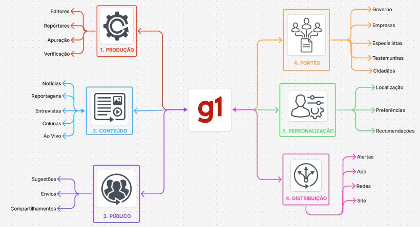
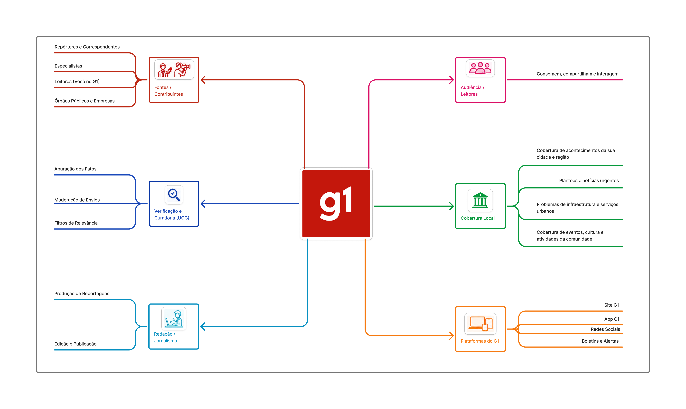
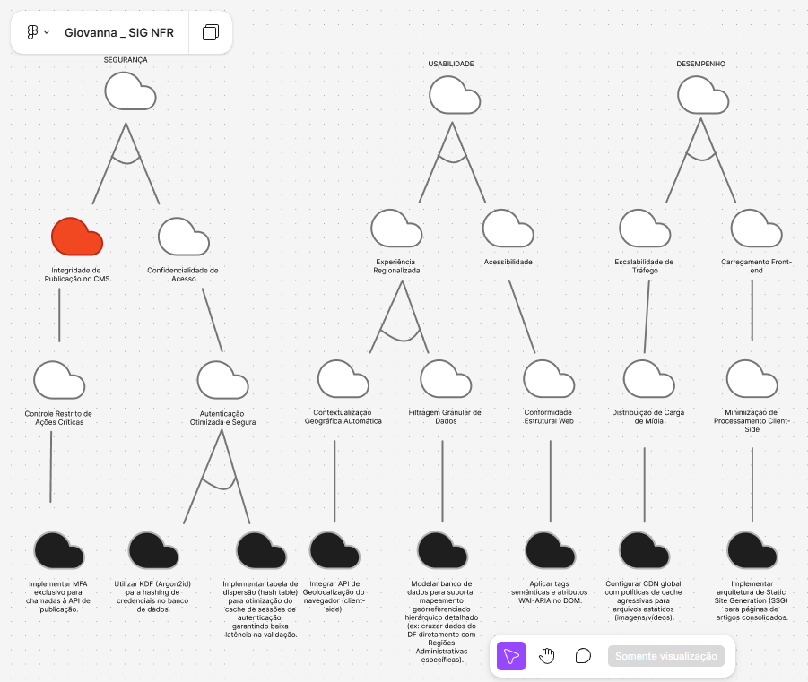
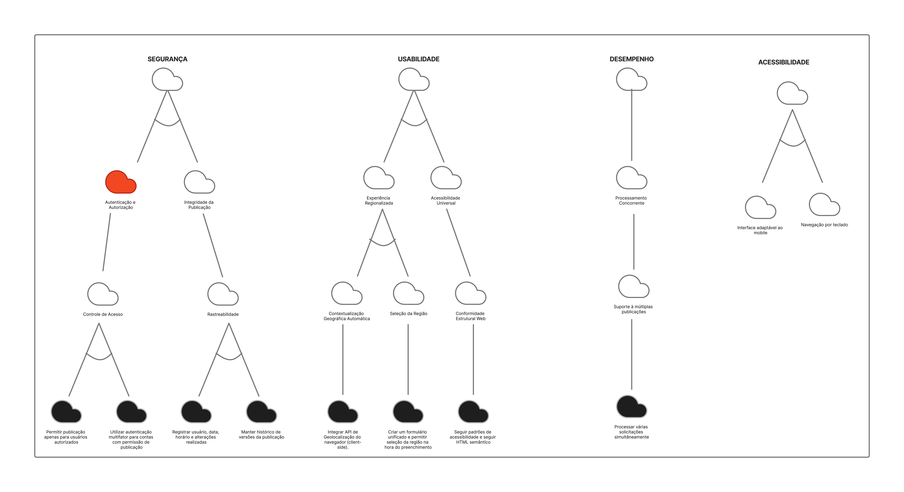
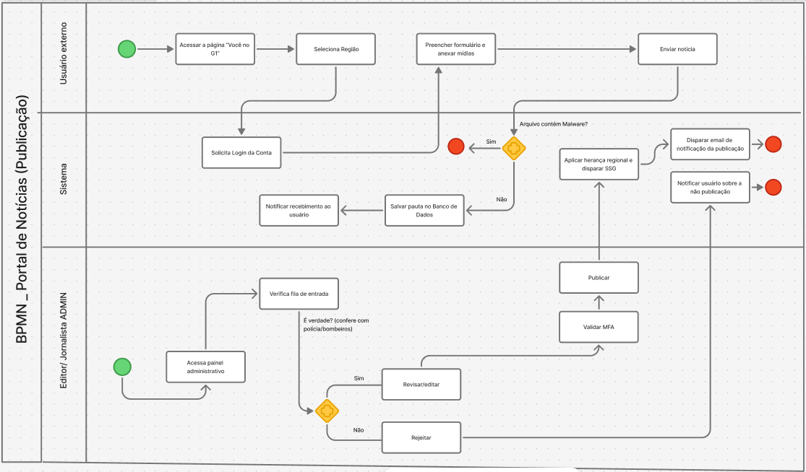
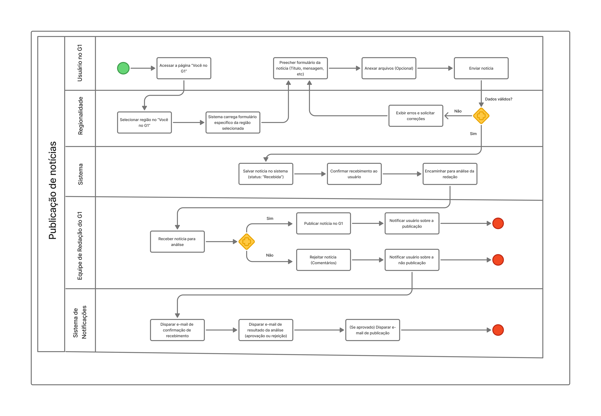

# SubEquipe_03

## Focos do Relatório:
### FOCO_01: Artefatos Generalistas & NFR Framework
### Participantes no Foco_01
| Participantes |
|---------------|
|DAVI GONCALVES LEITE FEITOSA|
|GIOVANNA FELIPE GUIMARAES|
|JOHNNATAN DE SALLES SANCHES|

### Metodologia do Foco_01

Nosso sub-grupo optou por fazer a análise direcionada para o contexto do site [G1](https://g1.globo.com/), escolhido por ser uma plataforma de notícias conhecida no Brasil todo e por permitir analisar diferentes aspectos da produção e distribuição de conteúdo jornalístico.
Vídeo de reunião em: Atas de reuniões (Ata subgrupo 3)

### Mapa Mental

??? note "Mapa Mental Individual: Giovanna Felipe Guimarães"

    <figure style="text-align: center;">
        
        <figcaption>
            

                Figura : Rich Picture Individual (Fonte: <a href="https://github.com/giovannafg">Giovanna Felipe</a>, 2026)
            

        </figcaption>
    </figure>

??? note "Rich Picture Individual: Johnnatan de Salles"

    <figure style="text-align: center;">
        
        <figcaption>
            

                Figura: Mapa Mental Individual (Fonte: <a href="https://github.com/jsalless">Johnnatan de Salles</a>, 2026)
            

        </figcaption>
    </figure>

#### Insights Mapa Mental
- Os mapas mentais apresentaram diferentes atores e fontes envolvidos na produção de notícias, com disposições diferentes, mas que se complementaram bem na análise da plataforma.
- Foi identificado que é importante que um portal de notícias tenha uma definição clara dos temas abordados, orientando a organização e a cobertura do conteúdo. Entre os temas analisados no G1 estão política, economia, opinião e investigações. Davi também destacou a presença de eventos, cultura e atividades da comunidade, considerada relevante pelo grupo. Foi discutido ainda que o G1 apresenta atalhos na navbar para diferentes conteúdos.
- Johnnatan identificou a possibilidade de notificações push para informar os usuários sobre novas notícias, facilitando o acompanhamento de conteúdos recentes.
- Giovanna destacou que as notícias possuem atalhos de compartilhamento e envio, além da importância de considerar recomendações e distribuição de conteúdo de acordo com as preferências dos usuários.

### NFR Framework
SIG de requisitos não funcionais na notação do NFR Framework.

??? note "SIG NFR Framework Individual: Giovanna Felipe"

    <figure style="text-align: center;">
        
        <figcaption>
            

                Figura : SIG NFR Framework Individual (Fonte: <a href="https://github.com/giovannafg">Giovanna Felipe</a>, 2026)
            

        </figcaption>
    </figure>
#

??? note "SIG NFR Framework Individual: Johnnatan de Salles"

    <figure style="text-align: center;">
        
        <figcaption>
            

                Figura: SIG NFR Framework Individual (Fonte: <a href="https://github.com/jsalless">Johnnatan de Salles</a>, 2026)
            

        </figcaption>
    </figure>
#

#### Insights SIG NFR Framework
- O subgrupo se reuniu para discutir os três principais requisitos identificados: segurança, desempenho e usabilidade, percebendo que os integrantes estavam alinhados quanto à sua importância para a plataforma.
- O grupo considerou relevante a contextualização geográfica para personalizar o conteúdo apresentado aos usuários, contribuindo para a usabilidade sem comprometer a segurança.
- A principal dificuldade encontrada foi na definição do nível de detalhamento das nuvens, sendo observado que alguns integrantes detalharam mais as operacionalizações do que outros, devido às diferentes interpretações sobre o nível de abstração esperado.

### FOCO_02: Engenharia Reversa & Modelagem BPMN
### Participantes no Foco_02
| Participantes |
|---------------|
|DAVI GONCALVES LEITE FEITOSA|
|GIOVANNA FELIPE GUIMARAES|
|JOHNNATAN DE SALLES SANCHES|
### Metodologia do Foco_02
Vídeo de reunião em: Atas de reuniões (Ata subgrupo 3)
### Processo de Engenharia Reversa Aplicado
Para a engenharia reversa, o grupo explorou os principais fluxos do G1, buscando identificar pontos de interação entre o usuário e a plataforma: o acesso aos conteúdos e o envio de mídias.
### Modelagem BPMN
Para a análise do G1, o subgrupo utilizou a opção “Entre em contato”, que direciona para o espaço “VC no G1”, que possui diversas subáreas com regiões do Brasil, como ponto de partida para compreender o processo de envio de conteúdo. A partir da exploração do site, foram elaborados fluxos para representar tanto o processo de renderização e apresentação dos conteúdos ao usuário quanto o envio de mídias para a plataforma.

??? note "BPMN Individual: Giovanna Felipe Guimarães"

    <figure style="text-align: center;">
        
        <figcaption>
            

                Figura : BPMN Individual (Fonte: <a href="https://github.com/giovannafg">Giovanna Felipe</a>, 2026)
            

        </figcaption>
    </figure>

??? note "BPMN Individual: Johnnatan de Salles"

    <figure style="text-align: center;">
        
        <figcaption>
            

                Figura: BPMN Individual (Fonte: <a href="https://github.com/jsalless">Johnnatan de Salles</a>, 2026)
            

        </figcaption>
    </figure>

### Insights BPMN
- Percebeu-se que o envio de mídias pelo “VC no G1” exige autenticação por meio de uma conta Globo, estabelecendo uma etapa adicional no fluxo do usuário.
- Não foi possível visualizar o processamento interno da aplicação, sendo necessário inferir etapas do fluxo a partir do funcionamento esperado de um portal de notícias. Essa discussão foi interessante pois permitiu levantar possíveis processos, como a análise de malware nas mídias enviadas antes de sua disponibilização.

### FOCO_03: IA Generativa

| Nome do Membro | Lições Aprendidas | Uso da IA Generativa (SENSO CRÍTICO) |
| -------- | ----- | ----------- |
| Johnnatan de Salles Sanches | Compreendi melhor a elicitação de requisitos não funcionais por meio da elaboração de um SIG e a engenharia reversa foi possível identificar os principais componentes e fluxos da aplicação para entender como o usuário acessava as funcionalidades| O principal uso da IA foi facilitar a busca por conhecimento e contexto da solução. De maneira geral ela era boa para sugerir tópicos mas na hora de elaborar os diagramas e desenhos (que iria utilizar como suporte para fazer o meu) ela não conseguia fazer de maneira coesa e estruturada|
| Giovanna Felipe Guimaraes | Por ter pouca experiência com os modelos BPMN e NFR Framework, a elaboração dos artefatos foi desafiadora. Ainda assim, foi possível compreender melhor esses modelos e perceber como podem ser relevantes para a análise da qualidade de um software. | A IA foi utilizada inicialmente para verificar os fluxos elaborados, mas as respostas foram muito generalistas e pouco úteis para avaliar os diagramas. Por isso, seu principal uso foi no detalhamento de ideias para as nuvens pretas do NFR Framework e na busca por novas possibilidades para a análise.|

## Versionamentos
|Nome do Membro | Contribuição | Data
| -------- | ----- | ----------- |
| Johnnatan de Salles Sanches | Acrescenta artefatos individuais, lições aprendidas e ponto de vista sobre IA Generativa | 27/08/2026 |
| Giovanna Felipe Guimaraes | Acrescenta artefatos individuais, lições aprendidas e ponto de vista sobre IA Generativa | 27/08/2026 |
